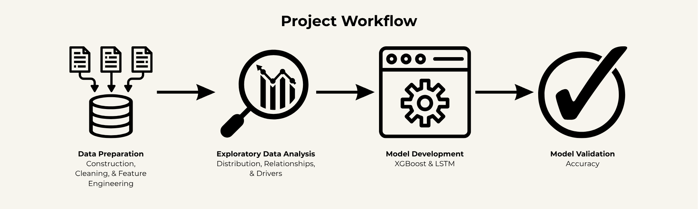

# Predictive Analysis of Dengue Fever Cases Using XGBoost and LSTM Machine Learning Models

## 📌 1. Overview
This project develops and compares machine learning models to predict **dengue cases in Indonesia**.

The objective is not only to achieve high predictive performance, but also to evaluate each model’s ability to capture **temporal dynamics, stability, and practical applicability** for real-world use.

---

## 📂 2. Dataset

The dataset is sourced from official Indonesia Health Profile reports (2018–2022) and is stored in the file `DBD_Indonesia.xlsx`.

### 📌 Data Characteristics
- Coverage: 34 provinces in Indonesia  
- Observations: 170 records  
- Data type: Panel / structured data  
- Variables: 20+ socio-demographic and healthcare features  

### 📌 Key Variables
- Population density  
- Human Development Index (HDI)  
- Poverty rate  
- Healthcare facilities (hospitals, clinics, etc.)  
- Public health indicators  
- Dengue case counts (target variable)  

---

## ⚙️ 3. Project Workflow

### 3.1. Data Preparation

The data preparation stage was conducted to ensure data quality, consistency, and suitability for machine learning and deep learning models.

- **Data cleaning and validation**  
  The dataset was inspected for missing values, inconsistencies, and anomalies. No missing values were found, indicating that the dataset was complete and suitable for further analysis.

- **Feature encoding**  
  Categorical variables (e.g., province identifiers) were transformed using one-hot encoding to convert them into a numerical format compatible with machine learning models.

- **Feature scaling**  
  Min-Max normalization was applied to the input features for the LSTM model. This scaling ensures that all variables are on a similar range, improving training stability and convergence in neural networks.

- **Train-test split**  
  The dataset was divided into training and testing sets using an 80:20 ratio.  
  - The training set was used to fit the models  
  - The testing set was used to evaluate model generalization on unseen data  

This preprocessing pipeline ensures that the models are trained on clean, well-structured, and properly scaled data, improving both performance and reliability.

---

### 3.2. Exploratory Data Analysis (EDA)

Exploratory Data Analysis (EDA) was conducted to understand the distribution and characteristics of dengue cases as well as the relationships between variables.

- **Analysis of dengue case distributions**  
  The distribution of dengue cases was analyzed across provinces and years to identify general trends, variability, and potential outliers in the data.

- **Identification of key socio-demographic drivers**  
  Relationships between dengue cases and socio-demographic variables, such as population density, Human Development Index (HDI), and healthcare infrastructure, were examined to identify potential predictors influencing the spread of the disease.

- **Comparison across provinces**  
  A comparative analysis was performed to observe differences in dengue case patterns between provinces, highlighting regional disparities in disease occurrence.

- **Data validation and consistency checks**  
  The dataset was further evaluated to ensure consistency across variables and years, confirming that the data structure is reliable for modeling.

The EDA results provide important insights into the underlying structure of the data and support the selection of appropriate modeling approaches.

---

### 3.3. Model Development

Two models were implemented to compare different modeling approaches:

---

#### 🟢 XGBoost (Machine Learning Approach)
- Tree-based gradient boosting model  
- Strong for structured tabular data  
- Provides feature importance for interpretability  
- Limited in capturing time-dependent patterns  

##### Hyperparameter Search Space
The hyperparameters were selected to balance model complexity, learning efficiency, and generalization performance.

- `n_estimators` controls the number of trees, affecting model capacity  
- `learning_rate` determines how quickly the model adapts to data  
- `max_depth` regulates model complexity and prevents overfitting  
- `random_state` ensures reproducibility  

Parameter combinations were evaluated using cross-validation to obtain stable and reliable performance.

- `n_estimators`: {50, 100, 150, 200, 250}  
- `learning_rate`: {0.01, 0.05, 0.10, 0.15, 0.20}  
- `max_depth`: {3, 4, 6, 8, 9}  
- `random_state`: {42}  

##### Cross-Validation
- 3-fold  
- 5-fold  
- 10-fold  

A total of **125 parameter combinations** were evaluated.

---

#### 🔵 LSTM (Deep Learning Approach)
- Recurrent neural network designed for sequential data  
- Captures temporal patterns in dengue cases  
- More suitable for time-series prediction  
- Less interpretable and computationally intensive  

##### Hyperparameter Search Space
The hyperparameters were designed to optimize the model’s ability to capture temporal dependencies while maintaining training stability.

- `lstm_units` control the capacity to learn sequential patterns  
- `dropout` is used for regularization to prevent overfitting  
- `dense_units` define the final feature representation  
- `batch_size` influences training stability and convergence  
- `epochs` determine the number of training iterations  

These configurations were systematically tested to identify the most accurate and stable model.

- `lstm_units_1`: {32, 64, 128}  
- `lstm_units_2`: {16, 32, 64}  
- `dropout_1`: {0.2, 0.3, 0.4}  
- `dropout_2`: {0.1, 0.2, 0.3}  
- `dense_units`: {8, 16, 32}  
- `batch_size`: {8, 16, 32}  
- `epochs`: {100}  

A total of **729 parameter combinations** were evaluated.

---

### 3.4. Model Validation

#### A. Evaluation Metric
- **Mean Squared Error (MSE)**  

#### B. Validation Approach
- Train-test evaluation  
- Cross-validation for XGBoost  
- Training vs validation loss monitoring (LSTM)  

### 3.5. Implementation Details
The analysis and modeling processes were implemented using Python in a Google Colab environment, with the code stored in the notebook `dbd_analysis.ipynb`.

---

## 🏆 4. Model Performance Comparison

### Top 3 Best Models (Based on MSE)

#### 🔵 LSTM

| Configuration | Train MSE | Test MSE |
|--------------|-----------|----------|
| Model 1      | 2,874,609.27 | 3,860,943.84 |
| Model 2      | 2,885,292.32 | 3,453,606.94 |
| Model 3      | 3,169,458.18 | 4,089,321.99 |

#### 🟢 XGBoost

| Configuration        | Train MSE | Test MSE |
|---------------------|-----------|----------|
| 10-fold CV         | 9,016,559.00 | 4,833,464.00 |
| 5-fold CV          | 10,812,922.00 | 5,398,128.00 |
| 3-fold CV          | 11,848,894.00 | 5,507,332.00 |

---

### Overall Comparison

| Model   | Train MSE | Test MSE |
|--------|----------|----------|
| **LSTM (Best)** | 2,874,609.27 | 3,860,943.84 |
| XGBoost (Best) | 9,016,559.00 | 4,833,464.00 |

---

### ✅ Selected Model: **LSTM**

After evaluating predictive performance, stability, and generalization:

**LSTM was selected as the final model** due to:

- Significantly lower MSE on both training and testing data  
- Strong ability to capture **temporal dependencies**  
- More consistent performance across different configurations  

---

### ⚠️ Why Not XGBoost?

Although XGBoost performs well on structured data, it has limitations in this project:

- Higher prediction error compared to LSTM  
- Less effective in modeling **time-series patterns**  
- Performance improves with higher cross-validation folds, but still falls behind LSTM  

Therefore, XGBoost is useful for **interpretability**, but less suitable for **temporal forecasting** of dengue cases.

## 📊 5. Key Insights

- Healthcare infrastructure (hospitals, clinics) is the strongest predictor of dengue cases  
- Socio-demographic factors such as population density and HDI play a significant role  
- Temporal patterns are critical in disease prediction  
- LSTM outperforms traditional ML models in capturing these dynamics  

---

## 💼 6. Business / Policy Implications

- Supports **early detection of potential outbreaks**  
- Enables **data-driven public health planning**  
- Improves **resource allocation in healthcare**  
- Provides insights for epidemic risk management  

---

## 📈 7. Tools & Technologies

- Python  
- XGBoost  
- TensorFlow / Keras (LSTM)  
- Data preprocessing and analysis libraries  

---

## ⚠️ 8. Notes

- Dataset is based on official government reports  
- Project is developed for academic purposes  
- Future improvements may include climate and environmental variables  
- It should be noted that results obtained from rerunning the models may differ from those reported in the original thesis.  
- This variation is primarily caused by the stochastic nature of model training (especially in LSTM) and potential differences in library versions and computational environments.  
- Despite these variations, the overall findings and model comparison remain consistent, where LSTM outperforms XGBoost in capturing temporal patterns.
---

## 👤 9. Author

Dylan Richard

## 🎓 10. Undergraduate Thesis Reference

This project was conducted as part of my undergraduate thesis (skripsi), which is written in Bahasa Indonesia.

**Translated Title:**  
*Predictive Analytics Project for Comparing XGBoost and LSTM Models in Estimating Dengue Cases in Indonesia*

The full thesis document (Indonesian version), titled `6162001168_Dylan Richard_Thesis Paper`, is included in this repository for reference.

